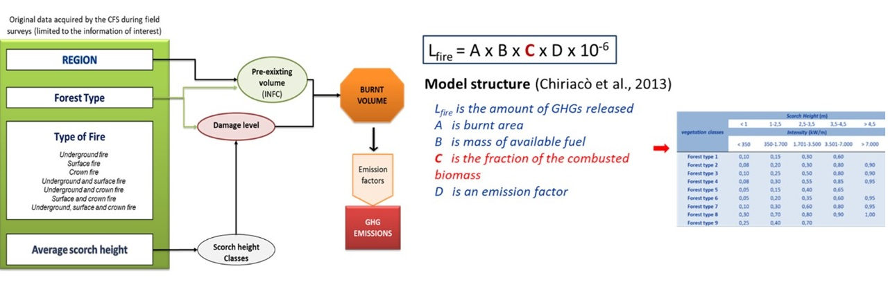

## Workflow to calculate GHGs from forest fires 

- **Conda users:** Please use `environment.yml` to install the required packages and dependencies to run the code in your virtual environment

- **Non-conda users**: Please use `requirements.txt` to install packages and dependencies to run the code in your virtual environment
