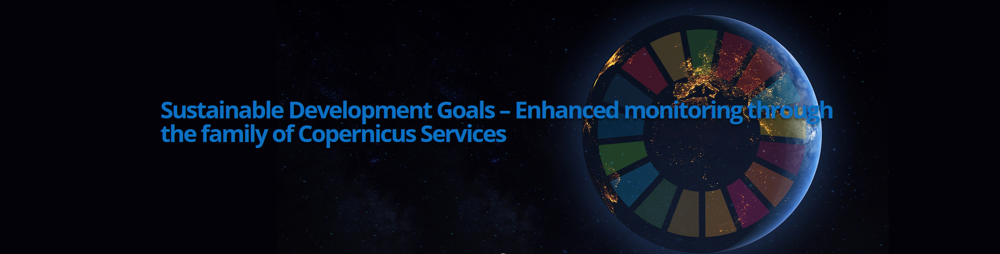
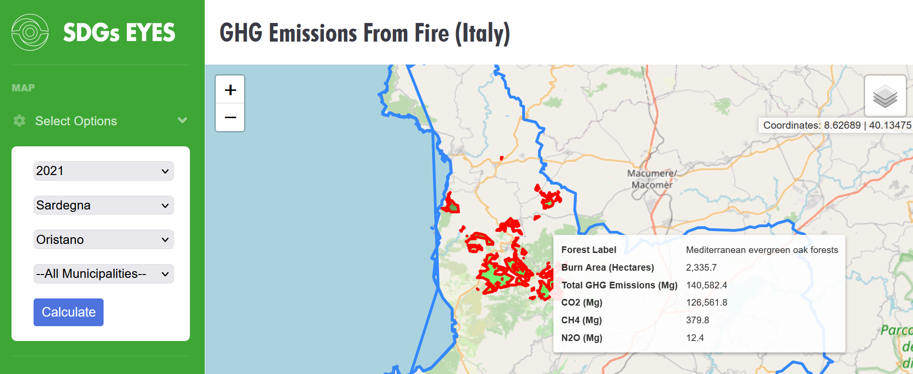
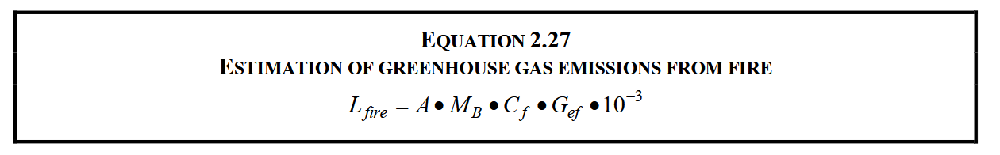

    

    

# **FIRE-TRACE - Tier 2 Monitoring of Greenhouse Gas Emissions from Forest Fires**

## **Advancing on SDGs indicators monitoring, reporting and accounting**

---

**Authors**: Chiara Aquino, Valentina Bacciu, Maria Vincenza Chiriacò, Alessandro D’Anca, Jishnu Jeevan, Sergio Noce, Adriana Torelli, Manuela Balzarolo 

**Date**: 11 December 2025

---

## **Table of Contents:**

1. [Introduction](#introduction)
2. [Estimating GHG emissions](#estimating-ghg-emissions)
3. [Visualisation of GHGs over selected region](#visualisation-of-ghgs-over-selected-region)
4. [Visualization of GHGs timeseries over selected region](#visualization-of-ghgs-timeseries-over-selected-region)
5. [Save your data](#save-your-data)

---

## **1. Introduction**

[Go back to the "Table of Contents"](#table-of-contents)

Wildfires have a long list of socioeconomic impacts, including material and human losses, biodiversity loss, and the advancement of desertification, among others. In addition to these direct impacts, wildfires are also a significant source of pollutant emissions that severely affect air quality and thus public health. Among the main pollutants generated by wildfires are **carbon monoxide (CO)**, a toxic gas released in large quantities due to the incomplete combustion of biomass, and **nitrogen dioxide (NO₂)**, formed in the atmosphere from the reaction of compounds such as **nitric oxide (NO)** and **nitrogen monoxide (NO)**. Additionally, large amounts of **sulfur dioxide (SO₂)**, a gas that contributes to acid rain formation, and **carbon dioxide (CO₂)**, one of the main greenhouse gases, are emitted.

Wildfires also generate suspended particles, especially **fine particulate matter (PM2.5)**, which can penetrate deep into the lungs, causing respiratory problems, and reach the bloodstream, leading to various cardiovascular conditions. The combination of these pollutants creates a significant burden on ecosystems, the atmosphere, and exposed populations, especially in areas close to the fires or under the influence of air currents that carry these emissions.

Resultantly, Greenhouse gas (GHG) emissions from forest fires are increasingly contributing to atmospheric concentrations of climate-altering gases and represent a growing and poorly constrained component of global carbon budgets, particularly under more frequent droughts and heatwaves. Closing this gap is critical for achieving the United Nations Sustainable Development Goal (SDG) 13, specifically indicator 13.2.2, “Total GHG emissions per year”, urging accurate quantification and monitoring for timely mitigation strategies. Here we introduce FIRE-TRACE, an Earth Observation-based framework integrating satellite data with field-based biomass measurements to improve estimates of forest fuel load and fire emissions. Unlike existing national inventories and global satellite products, FIRE-TRACE resolves spatial variation in burned area and fire severity at the scale of individual fires, enabling emission disaggregation across ecological and administrative units. This work advances SDG 13 by providing a standardised approach, demonstrated for Italy over the period 2018-2023 yet transferable to other countries and time periods, thereby strengthening national reporting capacities and advancing global climate monitoring.

Here we present two different workflows:
- `get_ghg_emissions_with_in_situ_forest_biomass.ipynb` that leverages on in-situ data
- `get_ghg_emissions_with_esa_forest_biomass.ipynb` that leverages on remote sensing data

For the complete implementation, refer to [`scripts`](scripts).

    
     
    <em><a href="http://51.158.73.145:5000/">Burnt area of the wildfires in Oristano, Sardinia region, 2021.</a></em>

### Used Datasets

The Copernicus Service offers a wide variety of environmental data that can be used for multiple purposes. The available products include observational data, remote sensing, modeling, ocean and climate indicators, etc. Each type of data has its own characteristics, such as spatial and temporal resolution, available variables (physical, chemical, biogeochemical), frequency of database updates, and more.

By leveraging Copernicus data, the workflow presented here provides high spatial and temporal coverage, allowing us to assess GHG emissions across the entire study area, for a year of choice.

---

## **2. Estimating GHG emissions**

[Go back to the "Table of Contents"](#table-of-contents)

This script provides the functions used to calculate GHG emissions from forest fires. GHG emissions (CO₂ + NO₂ + CH₄) are calculated using the IPCC equation (2006):

    

where:  
**Lfire** = amount of GHGs released as a result of fire [kgton of GHG];  
**A** = burnt area [ha], provided by EFFIS Burn data product  
**Mv** = mass of available fuels, in [kg dry matter ha⁻¹], provided by Corine Land Cover level IV crosslinked with INFC carbon pools  
**Cf** = combustion factor, portion of biomass combusted [dimensionless], derived from EFFIS Fire severity product and the biomass efficiency model calibrated for Italy (Aquino et al., 202X)  
**Gef** = emission factor [g GHG kg⁻¹] for each GHG compound, taken by the NEIVAv1.0 database

### References 

- Intergovernamental Panel on Climate Change (IPCC), 2006. 2006 IPCC guidelines for national greenhouse gas inventories. _Institute for global environmental strategies, Hayama, Kanagawa, Japan_.

- Chiriaco, M.V., Perugini, L., Cimini, D., D'Amato, E., Valentini, R., Bovio, G., Corona, P. and Barbati, A., 2013. Comparison of approaches for reporting forest fire-related biomass loss and greenhouse gas emissions in southern Europe. _International Journal of Wildland Fire_, 22(6), pp.730-738.

### Set up workflow to calculate GHGs from forest fires 

- **Conda users:** Please use [`environment_GHG.yaml`](\environment_GHG.yaml) to install the required packages and dependencies to run the code in your virtual environment

- **Non-conda users**: Please use `requirements.txt` to install packages and dependencies to run the code in your virtual environment

#### **Select parameters and input data**

---

## **3. Visualisation of GHGs over selected region**

[Go back to the "Table of Contents"](#table-of-contents)

---

## **4. Visualisation of GHGs timeseries over selected region**

[Go back to the "Table of Contents"](#table-of-contents)

---

## **5. Save data**

[Go back to the "Table of Contents"](#table-of-contents)